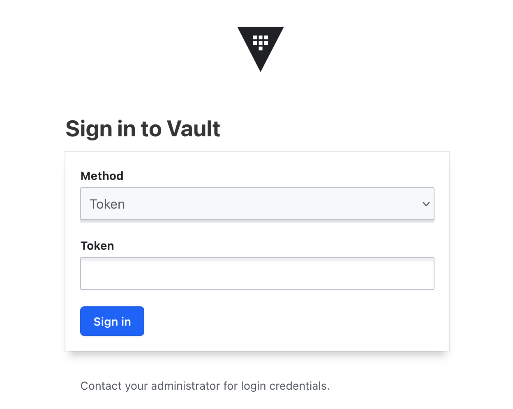
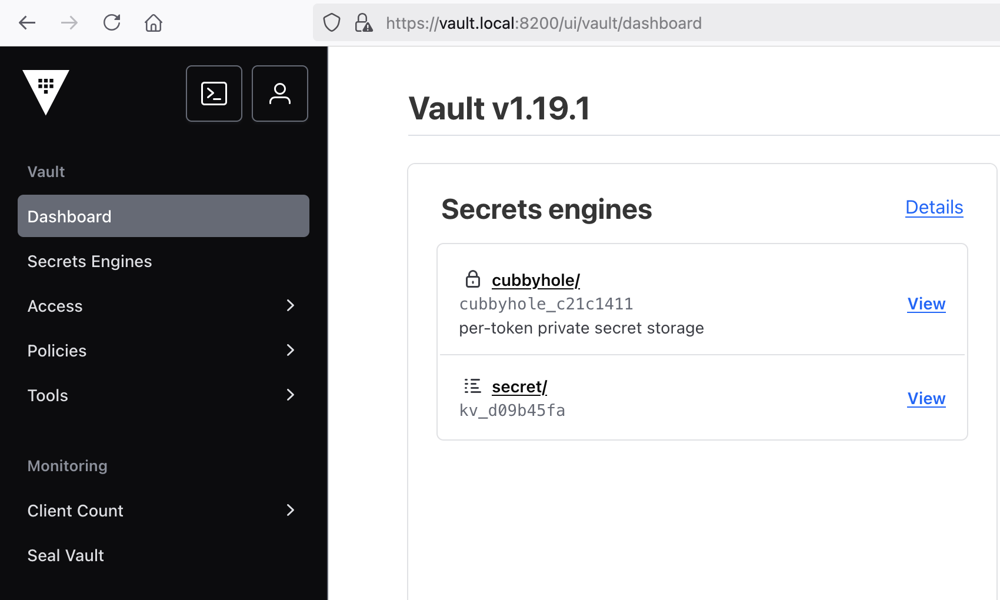
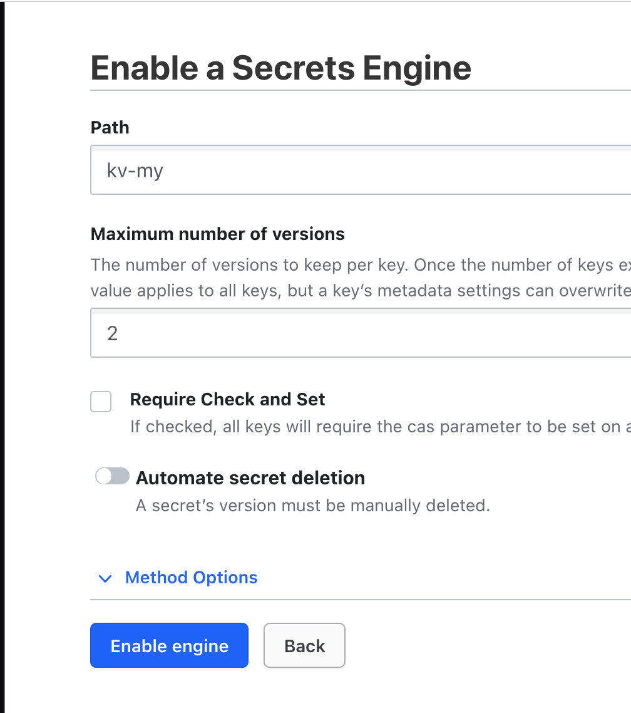
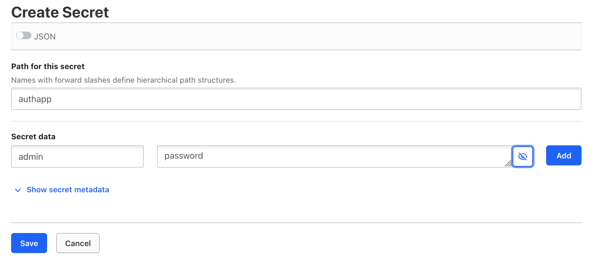
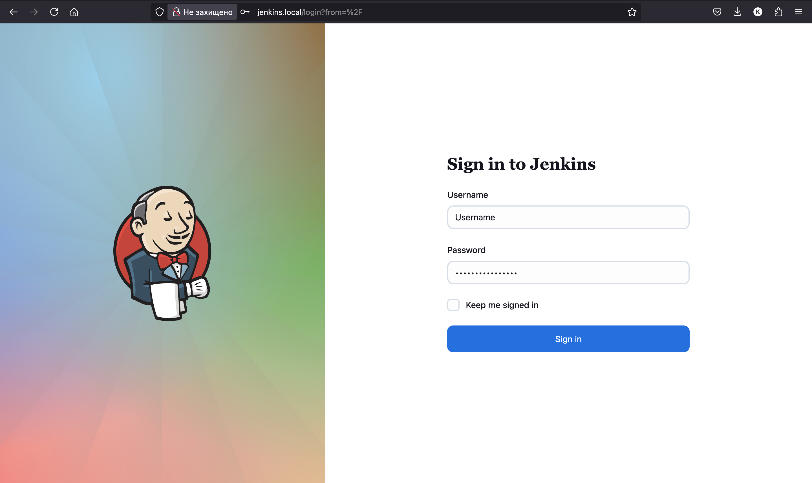
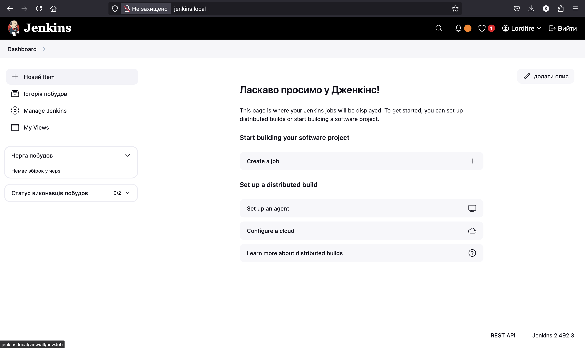
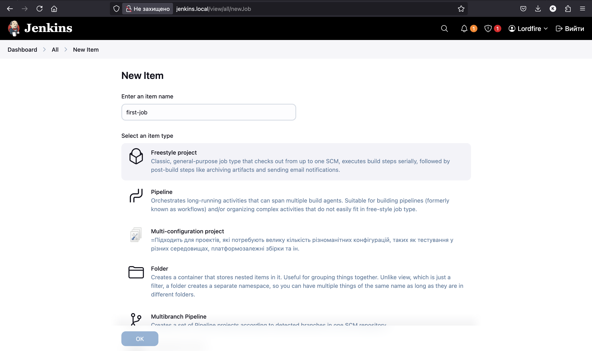
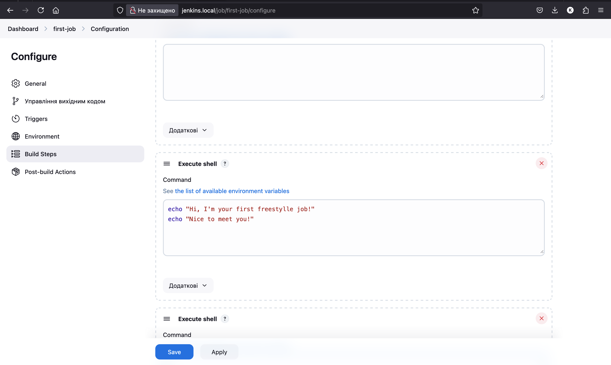
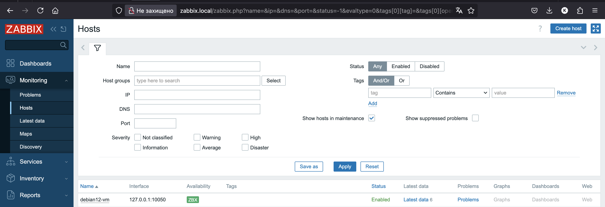
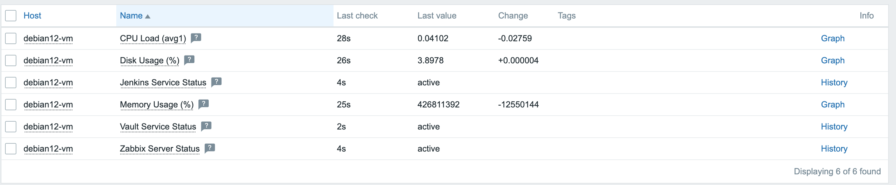

# Debian 12 VM with Zabbix, Vault and Jenkins via Vagrant
This project provisions a VM using Vagrant and sets up the following services:
- **Vault** for secrets managnment
- **Jenkins** for CI/CD automation
- **Zabbix** for VM and services status monitoring
---
## Prerequisites
- Vagrant - (https://developer.hashicorp.com/vagrant/install "v2.4.3")
- VirtualBox - (https://www.virtualbox.org/wiki/Downloads "7.0.12r159484 or higher")
- And, i hope that you have it, an Internet connection
## How to launch the VM ?
1. Access the cloned repository on your machine
```bash
cd ~/<DIRECTORY-WITH-REPOSITORY>/debian12-vm-with-services-main
```  
2. Run the following in your terminal
```bash
vagrant up
```
---

# How to access the services 
Services can be accessed by following URL's :
- Vault - https://vault.local:8200
- Jenkins - http://jenkins.local
- Zabbix - http://zabbix.local

---
# Examples of services usage
## 1. Vault
### How to write a secret
1. Using CLI :
  * Step 1 : SSH into VM
  ```bash
  vagrant ssh
  ```
  * Step 2 : Login into account
  ```bash
  vault login
  ```
  > You will be promted a root token which you can find in /home/vagrant/keys

  * Step 3 : Enable a secret engine (first time launch) (we will use KV as an example)
  ```bash
  vault secrets enable -path=secret kv-v2
  ```
  * Step 4 : Add a secret 
  ```bash
  vault kv put secret/myapp username="admin" password="s3cr3t"
  ```
**_DONE!_**

2. Using UI :
  * Step 1 : Open https://vault.local:8200
  * Step 2 : Login into Vault using token > Which you can find in /home/vagrant/keys. 
  
  * Step 3 : Go to "Secret engines".
  
  * Step 4 : Click "Enable new engine" or choose existing one and click "Create secret".
  
  * Step 5 : Set a path, input secret data and save.
  

## 2. Jenkins
###  How to create a freestyle job
  * Step 1 : Open http://jenkins.local and login into Jenkins.
  
  * Step 2 : Click "New item".
  
  * Step 3 : Enter a name and choose "Freestyle project".
  
  * Step 4 : Configure your job, starting with "Source code managnment".
  
  * Step 5 : Click save.

## 3. Zabbix
### What is visible in Zabbix monitoring?
Screenshot :


> explanation


